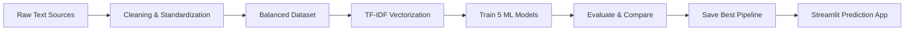

<p align="center">
  
</p>

<h1 align="center">Stress Level Classifier</h1>

<p align="center">
  A machine-learning project that classifies short English text responses into <b>Low</b>, <b>Medium</b>, or <b>High</b> stress levels.
</p>

<p align="center">
  
  
  
  
</p>

---

## Overview

**Stress Level Classifier** is a supervised text classification project built for the CSCI417 Machine Intelligence course.  
The system takes a journal entry, survey answer, or short written response and predicts whether the text reflects **Low**, **Medium**, or **High** stress.

The project includes the full workflow:

- Dataset collection from an online mental-health text dataset and additional Stack Exchange scraping.
- Dataset standardization into one consistent format.
- Cleaning, duplicate removal, balancing, and inspection.
- TF-IDF text vectorization.
- Training and comparison of five machine-learning algorithms.
- Saving the best model as a reusable pipeline.
- A Streamlit interface for live predictions.

> **Important:** This is an educational machine-learning project. It is **not** a medical diagnosis tool and should not be used as a replacement for professional mental-health support.

---

## Demo Workflow



---

## Final Dataset

The final modeling dataset is:

```text
data/processed/stress_level_dataset_v2_balanced.csv
```

| Stress Level | Rows |
|---|---:|
| Low | 1,841 |
| Medium | 1,841 |
| High | 1,841 |
| **Total** | **5,523** |

The dataset is intentionally balanced so that each class contributes equally during model training and evaluation.

---

## Models Trained

Five algorithms were trained and compared on the same dataset:

1. **Multinomial Naive Bayes**
2. **Logistic Regression**
3. **Linear Support Vector Machine**
4. **K-Nearest Neighbors**
5. **Decision Tree**

The best model was selected using **Macro F1-score**, which is suitable here because the task has three classes and we want balanced performance across Low, Medium, and High stress levels.

---

## Results

| Model                   |   Accuracy |   Macro Precision |   Macro Recall |   Macro F1 |
|:------------------------|-----------:|------------------:|---------------:|-----------:|
| Logistic Regression     |      0.776 |             0.78  |          0.776 |      0.778 |
| Linear SVM              |      0.757 |             0.759 |          0.758 |      0.758 |
| Multinomial Naive Bayes |      0.719 |             0.722 |          0.719 |      0.719 |
| K-Nearest Neighbors     |      0.706 |             0.71  |          0.706 |      0.707 |
| Decision Tree           |      0.707 |             0.718 |          0.707 |      0.706 |

**Best model:** `Logistic Regression`  
**Best Macro F1:** `0.778`

The saved model pipeline is located at:

```text
models/best_stress_level_pipeline.joblib
```

---

## Streamlit App

The project includes a simple interface for entering text and getting an instant stress-level prediction.

### Run the app locally

```bash
streamlit run app.py
```

The app includes:

- Live prediction for custom text.
- Low / Medium / High stress output.
- Class confidence scores when supported by the model.
- Project information page.
- Model comparison page.

---

## Installation

### 1. Clone the repository

```bash
git clone https://github.com/YOUR_USERNAME/Stress-level-classifier.git
cd Stress-level-classifier
```

### 2. Create and activate a virtual environment

```bash
python -m venv .venv
```

Windows:

```bash
.venv\Scripts\activate
```

macOS / Linux:

```bash
source .venv/bin/activate
```

### 3. Install dependencies

```bash
pip install -r requirements.txt
```

### 4. Run the interface

```bash
streamlit run app.py
```

---

## Reproducing the Project

Recommended order:

| Step | File | Purpose |
|---:|---|---|
| 1 | `notebooks/01_scraping_stackexchange.ipynb` | Collect additional text examples from Stack Exchange. |
| 2 | `notebooks/02_data_inspection_cleaning.ipynb` | Inspect, clean, merge, and balance the dataset. |
| 3 | `notebooks/phase2_modeling.ipynb` | Train, evaluate, compare, and save the best model. |
| 4 | `app.py` | Run the final Streamlit application. |

Reusable scripts are also available in `scripts/` for dataset building, scraping, and merging.

---

## Repository Structure

```text
Stress-level-classifier/
├── app.py                              # Streamlit prediction interface
├── requirements.txt                    # Python dependencies
├── README.md                           # Main GitHub documentation
├── data/
│   ├── raw/                            # Original downloaded/scraped data
│   ├── interim/                        # Intermediate generated datasets
│   └── processed/                      # Final cleaned datasets for modeling
├── docs/
│   ├── MODEL_CARD.md                   # Model limitations and intended use
│   ├── PROJECT_STRUCTURE.md            # Detailed repository guide
│   ├── GITHUB_UPLOAD_GUIDE.md          # GitHub publishing steps
│   ├── LINKEDIN_POST.md                # Ready-to-edit LinkedIn announcement
│   └── assets/                         # README visuals
├── metadata/                           # Source metadata and label mapping rules
├── models/                             # Saved trained model pipeline
├── notebooks/                          # Notebook-based workflow
├── reports/                            # Reports, figures, metrics, predictions
└── scripts/                            # Reusable data collection/preprocessing scripts
```

---

## Key Files

| File | Description |
|---|---|
| `app.py` | Final Streamlit app. |
| `models/best_stress_level_pipeline.joblib` | Saved best-performing ML pipeline. |
| `reports/phase2/model_comparison_metrics.csv` | Evaluation metrics for all five models. |
| `reports/figures/model_comparison_macro_f1.png` | Model comparison figure. |
| `reports/phase2/test_set_predictions.csv` | Test-set predictions from each algorithm. |
| `reports/stress_level_classifier_ieee_report.pdf` | Final IEEE-style project paper. |

---

## Limitations

- The labels are based on source labels and mapping rules, so some examples may be noisy.
- Scraped text can contain indirect or imperfect stress signals.
- The model only understands patterns present in the training data.
- The project is built for educational demonstration, not clinical use.

---

## Team

- Kerollos Emad
- Nardeen Raafat

---

## Suggested Citation

```bibtex
@misc{stress_level_classifier_2026,
  title  = {Stress Level Classifier},
  author = {Kerollos Emad and Nardeen Raafat},
  year   = {2026},
  note   = {Machine Intelligence course project}
}
```

---

## License

No open-source license has been selected yet. Add a license before allowing reuse or redistribution.
